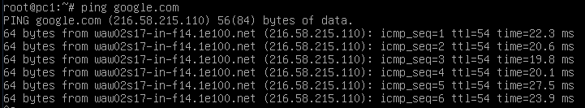
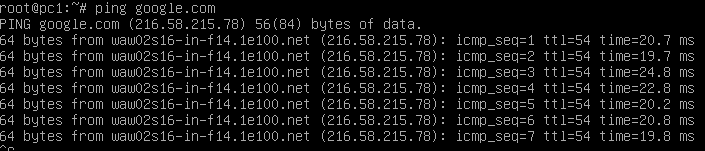

Zadanie 1
---------

1. Zaprojektuj oraz przygotuj prototyp rozwiązania z wykorzystaniem oprogramowania ``VirtualBox`` lub podobnego. 
Zaproponuj rozwiązanie spełniające poniższe wymagania:
   * Usługodawca zapewnia domunikację z siecią internet poprzez interfejs ``eth0`` ``PC0``
   * Zapewnij komunikację z siecią internet na poziomie ``LAN1`` oraz ``LAN2``
   * Dokonaj takiego podziału sieci o adresie ``172.22.128.0/17`` aby w ``LAN1`` można było zaadresować ``500`` adresów natomiast w LAN2 ``5000`` adresów    
   * Przygotuj dokumentację powyższej architektury w formie graficznej w programie ``DIA``
 
Rozwiązanie
-----------

Podział sieci
-------------
| sieć | adres | maska |
|:-----|:------|:------|
| LAN1 | 172.22.160.0 | 255.255.254.0/23 |
| LAN2 | 172.22.128.0 | 255.255.224.0/19 |

PC0 - z dostępem do internetu
---
|  interfejs   | adres  |
|:-------------| :------| 
| enp0s3 | 172.22.160.1/23  |
| enp0s8 | 172.22.128.1/19  |

PC1
---
|  interfejs   | adres  |
|:-------------| :------|
| enp0s3 | 172.22.160.2/23 | 

PC2
---
|  interfejs   | adres  |
|:-------------| :------| 
| enp0s3 | 172.22.128.2/19 |

--------------

**1. Ustawienie adresu ip:**  
``ip addr add`` + ip + ``dev`` + interfejs  

**2. Włączenie przekazywania adresów na PC0:**  
``echo 1 > /proc/sys/net/ipv4/ip_forward``

**3. Dodanie trasy na PC1 i PC2:**  
``ip route add default via`` + adres ip PC0 odpowiedni dla danej karty

**4. Ustawienie DNS w pliku:**  
``pico /etc/resolv.conf``  

**5. Dodanie wpisu do tablicy routingyuna PC0:**  
``iptables -t nat -A POSTROUTING -o`` + interfejs z dostępem do internetu + ``-j MASQUERADE``

### Pingowanie google.com z pc1
 

### Pingowanie google.com z pc2
 
